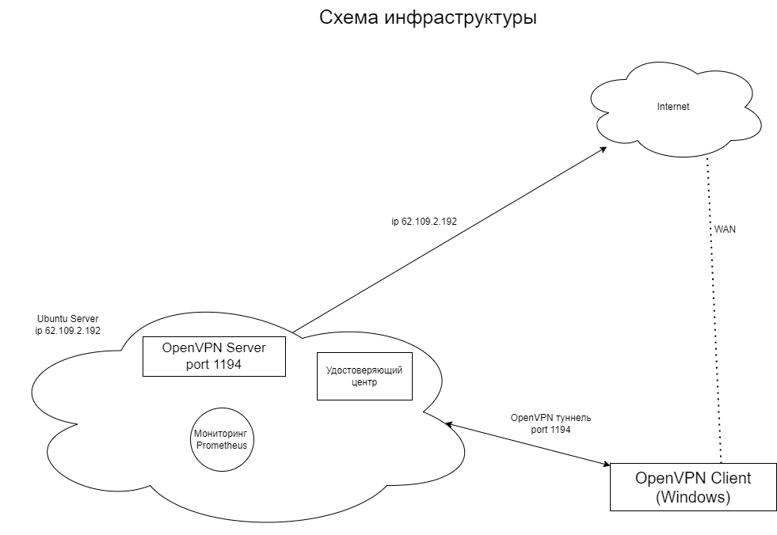

# Руководство системного администратора
## Вводные
Судя по вводным у нас молодая компания сотрудники которой не работают с конфиденциальной и критически важной информацией, соответственно можно допустить размещение удостоверяющего центра и VPN сервера на одной ВМ. 

Как временаня мера: Файл с ключем  удостоверяющего центра ( /usr/share/easy-rsa/pki/private/ca.key) следует зашифровать программой gpg

В процессе развития инфраструктуры можно запланировать разведение сервисов по разным ВМ.

На сервере необходимо создать нового юзера, отличного от root, дав ему группу прав sudo, доступ к серверу есть только у администратора.

Адрес нашего сервера 62.109.2.192

Репозиторий: https://github.com/parasky-john/skillbox

Схема инфраструктуры и потоков данных приложены в конце документа

## Разворачивание инфраструктуры на чистой ОС:
Создание пользователя admin. Добавление пользователя в группу sudo. Руководство по утсановке УЦ, OpenVPN, Prometheus приведено в следующих разделах данного руководства. После ключ удостоверяющего центра ( /usr/share/easy-rsa/pki/private/ca.key) следует зашифровать программой gpg

### Настройка Cron
Под пользователем _root_:

Переносим _backup.sh_ в _/usr/local/backup.sh_ (пояснения в разделе резрвного копирования)

Даем права на исполнение `chmod +x /usr/local/backup.sh`

Командой `crontab – e` вызываем редактор планировщика и  добавляем 
`0 0 * * * /usr/local/backup.sh`

## Установка Удостоверяющего Центра и создание сертификата Центра

Процедура развертывания удостоверяющего центра реализована скриптом и прилагающимся к нему deb-пакетом, который несет нужные конфигурационные файлы. Скрипт _inst_easy_rsa.sh_ и пакет _rsa_0.1-1_all.deb_ кладутся в папку _/tmp_ сервера. Если необходимо изменить пути – необходимо поправить соответствующие переменные в начале скрипта.

Необходимые комментарии присутствуют в коде скрипта. В итоге мы получим ключ и сертификат Удостоверяющего центра.

## Установка VPN Сервера, создание сертификатов сервера и клиента, сетевые настройки, запуск службы

Вся процедура реализована скриптом _inst_openvpn.sh_ и прилагающимся к нему deb-пакетом _vpn-cl-conf_0.1-1_all.deb_, который несет нужные конфигурационные файлы. В этом же скрипте производятся необходимые настройки портов и маршрутизации трафика, производится запуск сервиса vpn-сервера.

Процедура генерации ключа и сертификата клиента подразумевается на стороне сервера.

Администратор любым способом получает от клиента его данные (ФИО и т.д) и генерирует комплект ключ\сертификат. После формирует файл конфигурации _*.ovpn_ и передает этот файл клиенту с памяткой по подключению VPN-клиента.

Создание первого клиентского пакета уже включено в скрипт установки VPN сервера _inst_openvpn.sh_

Секретный ключ как сервера так и сертификата перемещается в соответствующую папку VPN сервера, тем самым изолируется от Центра сертификации (имитация разделения сервисов по двум серверам)

Последующие генерации клиентских ключей и конфигурационных файлов осуществляются скриптом _client-maker.sh_ Путь к конечному файлу _*.ovpn_ задается в `$OUTPUT_DIR`

В перспективе с ростом нагрузки процесс будет автоматизирован так, чтобы клиент на своей стороне генерировал ключ, создавал запрос на сертификат _*.csr_ и передавал на флешке системному администратору.

**Все скрипты и deb-пакеты кладутся в папку _/tmp_ сервера. Если необходимо изменить пути – необходимо поправить соответствующие переменные в начале скрипта.**

**OpenVPNServer работает на порте 1194**

## Мониторинг Prometheus

У нас в наличии только один сервер, поэтому разворачивать мониторинг будем на нем же. В случае когда сервер будет другой нужно будет исправить конф файл _prometheus.yml_ заменив в нем _localhost_ на адрес сервера, который следует мониторить. Также убедиться, что требуемые порты открыты.

### Prometheus

Состоит из 4х основных частей
•	**Prometheus server** – сама программа мониторинга, ставится через apt-get. Порт 9090

•	**Node exporter** – основные метрики ОС, ставится через apt-get. Порт 9100

•	**Openvpn exporter** – метрики openvpn. Качаем бинарный архив с https://github.com/kumina/openvpn_exporter/releases/tag/v0.3.0 далее архив пакуется в deb пакет prometheus_0.1-1_all.deb с другими необходимыми файлами. Порт 9176.

•	**Alertmanager** – надстройка к мониторингу для уведомления о критических событиях. ставится через apt-get. Порт 9093

### Набор необходимых конф. файлов и программ (находятся в пакете prometheus_0.1-1_all.deb):
•	_/etc/prometheus/prometheus.yml_ – конф. Файл Прометеуса

•	_/etc/prometheus/myrules.yml_ – мои описанные уведомления для Прометеуса

•	_/etc/prometheus/alertmanager.yml_ – конф файл для алертменеджера, в нем прописана настройка отправки уведомления на почту

•	_main.go_ – конф файл для Openvpn exporter, в нем указываем путь для записи лог файла

•	_v0.3.0.tar_ – дистрибутив Openvpn exporter, скачанный с https://github.com/kumina/openvpn_exporter/releases/tag/v0.3.0

### Собираем следующие метрики и устанавливаем предупреждения на e-mail:
•	CPU idle < 10%

•	cpu load averadge превышает количество доступных процессоров и не равно 0 в течении 5 мин

•	оперативная память используется > 85%

•	free inods <10% 

•	free space на разделе диска <10% 

•	время синхронизации убежало более 500мс в течении 5мин 

•	входящий сетевой трафик >80% 

•	Доступность OpenVpn

•	Количество клиентов впн сервера не более 10

•	Доступность всех таргетов прометеуса

### Установка
_prometheus.sh_ и _prometheus_0.1-1_all.deb_ необходимо положить в _/tmp_ на сервере и запустить `sudo ./prometheus.sh`

Скрипт вносит необходимые изменения, проверяет наличие установленного ПО, при необходимости ставит и настраивает. По итогу выводит состояние процессов для пользователя. Логи пишет в файл _error_log_.

**Веб интерфейс Прометеуса доступен по адресу _http://62.109.2.192:9090_**

## Резервное копирование и сценарии отказов

Мой сервер размещен на _https://firstvds.ru _

Они предоставляют различные варианты резервного копирования и сохранения инфраструктуры.

**Я выбрал несколько способов резервирования и хранения данных:**

•	Кибер Бэкап (ex-Acronis) _https://firstvds.ru/services/acronis _который позволит гибко настроить бэкап всей инфраструктуры и её восстановление в случае аварий

•	Второй вариант – это разворачивание инфраструктуры на чистый образ системы. При подходе к выполнению заданий выше я ориентировался на то, что при помощи скриптов и деп-пакетов смогу оперативно принести их на сервер и развернуть.

Сами скрипты и деп-пакеты хранятся в моем репозитории, который может быть закрыт для сторонних пользователей: _https://github.com/parasky-john/skillbox _

Также они сохранены на рабочем компьютере и выделенном флеш-носителе, который не используется в повседневной работе

Таким образом даже при отказе сервера, отключении хостинга критически важные данные для развертывания и восстановления системы остается у меня.

**Следующий важный момент резерирования – ключи и сертификаты.** 

Ключ удостоверяющего центра ( _/usr/share/easy-rsa/pki/private/ca.key_) следует зашифровать программой gpg

Я написал скрипт _backup.sh_, который собирает все ключи и сертификаты в один архив. Данный архив необходимо забирать с сервера _(/tmp/backup.tar.gz_”дата архива”)_ на отдельную флеш карту и хранить в недоступном 3м лицам месте. 
Планировщиком Cron сбор будет происходить ежедневно. Настройка _Cron_ описана в разделе _«Разворачивание инфраструктуры на чистой ОС»_

**Варианты отказов:**

•	Частичный запуск служб после перезагрузки сервера

Анализ ситуации по уведомлениям от alertmanager, анализ по веб-интерфейсу Prometheus, при необходимости ручной мониторинг и перезапуск службы systemctl, использование journalctl для глубокого анализа проблемы

•	Отказы на сервере, связанные с отсутствием свободного места на диске

Анализ ситуации по уведомлениям от alertmanager, анализ по веб-интерфейсу Prometheus, очистка временных файлов, логов

•	Отказ ОС, неработоспособность, некорректный запуск

Попытка штатно запустить ОС. Если проблема явно не выявлена и\или это потребует больших временных ресурсов – восстановление из бэкапа всего сервера средствами Кибер Бэкап (ex-Acronis). Крайний случай – разворачивание инфраструктуры на чистом образе ОС

•	Полное отсутствие связи с облачным сервером

Оперативная связь с хостингом, анализ информации. Если подтверждается проблема на стороне хостинга – анализ возможных временных потерь. Крайний случай – разворачивание инфраструктуры на чистом образе ОС у другого провайдера

•	Компрометация ключа VPN сервера\Удостоверяющего центра

Удаление ключа сервера _/etc/openvpn/server/server.key_

Удаление ключа удостоверяющего центра _/usr/share/easy-rsa/pki/private/ca.key_

Генерация новых ключей соответствующим скриптом _inst_easy_rsa.sh (УЦ)\ inst_openvpn.sh (VPN server)_

